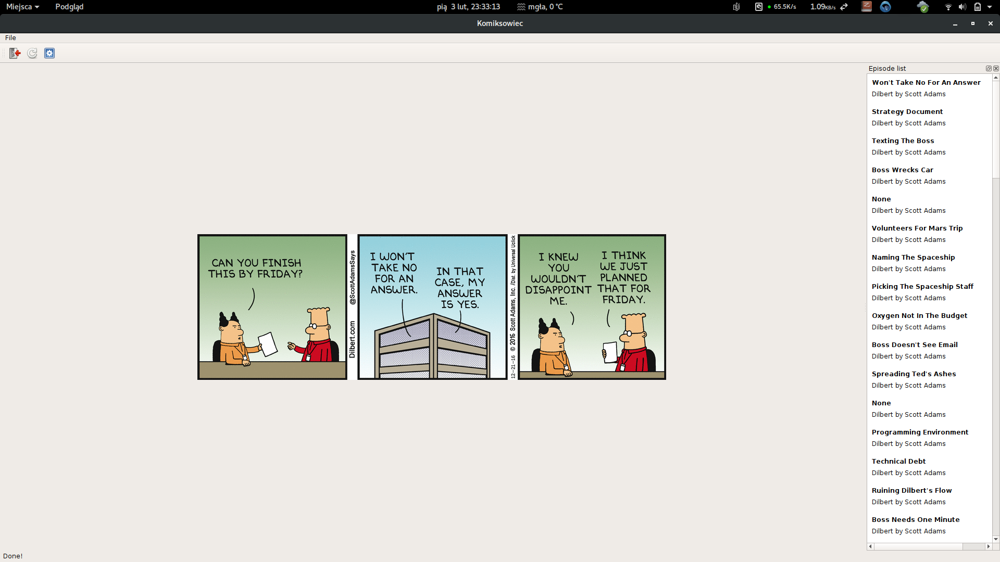
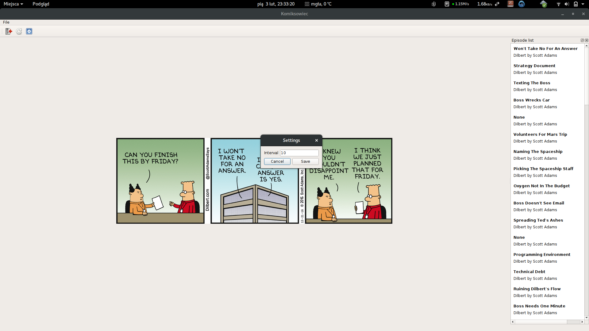
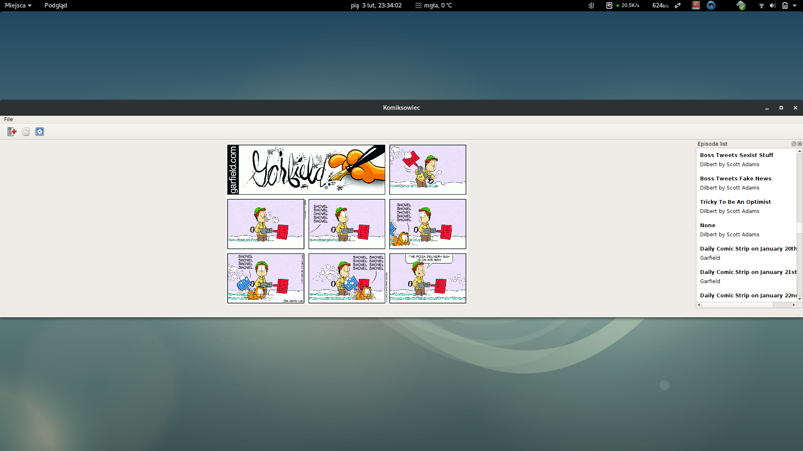

User guide
==========

Installation
------------

Install with::

    pip3 install --user -r requirements.txt

All requirements are currently in requirements.txt file, but it is subject to change in the near future (setup.py might be better because of the possibility of installing application icons and binaries easily).

Please also find a way in your distribution to install PyQt5 for Python 3.

Startup
-------
Run with::

    python3 -m komiksowiec

At startup application tries to update all the feeds so it might take a while for it to start depending on the network connection.
Update is done with the same thread as UI to avoid any lacks of sinchronization so interface might feel a little slugish on the first look.

Most of the comic plugins, in order not to overload the comic servers, try to limit the number of queries they use.
Most of them limit the update to three latest episodes (3-4 http requests) so user must keep starting the application every couple of days (depending on comics).

One might want to update their feeds from command line tools and "cron". If there will be interest in such additition, it might be written easily due to the construction of the backend.

Auto update
-----------
In addition to startup updates, application updates the feeds every n minutes.
This time might be adjusted in settings.
There are the same UI implications as before.

Settings
--------

User might want to tune some settings. Currently it's only the interval between auto updates, but it might be subject to change in the future - all the boilerplate is ready for the new settings.

Offline mode
------------
Application tries to cache as much data as it can and tries to handle newtork outages properly.

Most of the network outages are handled per-request so even unavailability of one network service should not make whole application unusable.

Application drops the errors silently (it only shows the info on status bar and on stdout) so it might be hard to notice any drops.

Images are cached too.

Other
-----

Some comics are too big even for today's standard so if any image is bigger than the available space it will be rescaled to fit it properly (keeping it's aspect ratio).
